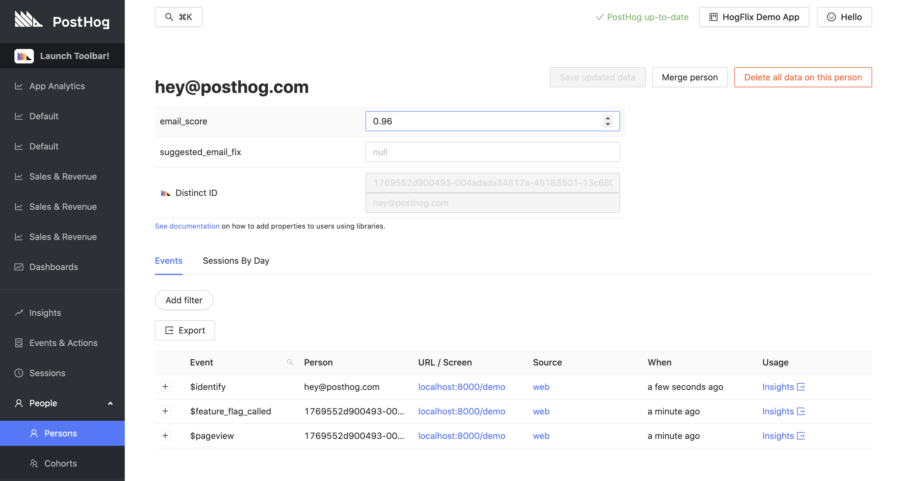

# Mailboxlayer Plugin (Beta)

Get email scores for users using the Mailboxlayer API and add them to PostHog user profiles. Suggested fixes will also be added if available.

## Installation

1. Visit 'Project Plugins' under 'Settings'
2. Enable plugins if you haven't already done so
3. Click '+ Install new plugin'
4. Type in a name for the plugin under 'Write The Code' and click 'Start Coding'
5. When the editor opens, paste the contents of the `plugin.js` file under 'Source Code' and the contents of `config.json` under 'Config Schema JSON'
6. Hit 'Save' and the configuration options will appear for you to fill in
7. Fill in the configuration options and hit 'Save' again
8. Enable your plugin and you're good to go!
